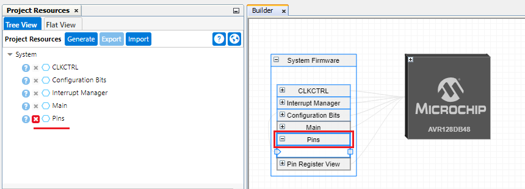
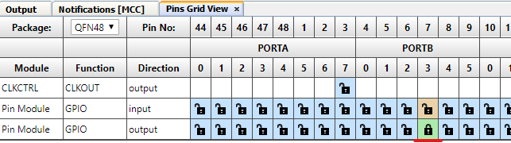
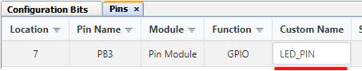
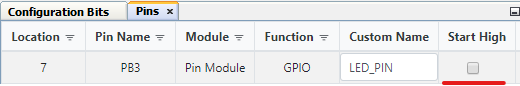

<!-- Please do not change this logo with link -->
[](https://www.microchip.com)

# Hello World LED

This example shows how to configure the LED on the AVR128DB48 Curiosity Nano to light up using drivers in MPLAB Code Configurator (MCC). The example uses the Pin Manager to configure the correct pin to be an output and to provide the correct output voltage for lighting the LED.

<!--  -->
<p>
	
</p>


## Related Documentation

- [AVR128DB48 device page](https://www.microchip.com/wwwproducts/en/AVR128DB48)
- [MPLAB Code Configurator](https://www.microchip.com/en-us/development-tools-tools-and-software/embedded-software-center/mplab-code-configurator)


## Software Used

Microchip’s free MPLAB X IDE, compiler and MPLAB Code Configurator (MCC) graphical code generator are used throughout the application firmware development to provide easy and hassle-free user experience. Following are the tool versions used for this example:

- [MPLAB® X IDE v5.45](https://www.microchip.com/mplab/mplab-x-ide) or newer
- [MPLAB® Xpress IDE](https://www.microchip.com/xpress) (alternative to MPLAB X IDE)
- [XC8 Compiler v2.32](https://www.microchip.com/mplab/compilers) or newer
- [MPLAB® Code Configurator (MCC) v4.1.0](https://www.microchip.com/mplab/mplab-code-configurator) or newer
- [MPLAB® Melody Library 1.37.26 or newer](https://www.microchip.com/mplab/mplab-code-configurator) or newer
- [MCC Device Libraries 8-bit AVR MCUs 2.7.0](https://www.microchip.com/mplab/mplab-code-configurator) or newer
- [Microchip AVR128DB48 Device Support Pack AVR-Dx_DFP 1.7.98](https://packs.download.microchip.com/) or newer


## Hardware Used

- [AVR128DB48 Curiosity Nano](https://www.microchip.com/DevelopmentTools/ProductDetails/PartNO/EV35L43A)


## Setup

MCC with the Melody library was used to implement this example as shown in the following section.

### Pin Configuration
The Pin controlling the onboard LED on the Curiosity Nano board was configured using the Pins Grid View. The Pins Grid View is accessed by clicking on the *Pins* line in *Project Resources* window, or by clicking on *Pins* block under *System Firmware* in the *Builder* window.

*Project Resources and Builder Windows*



Then the pin connected to the LED, PB3, was selected as an output by clicking the corresponding padlock symbol.

*Pins Grid Views*




The pin was also configured with a custom name to make the generated API more readable. 

*Custom Pin Name*




The API is not needed in this application since the pin does not change, but if the user would like to configure it, the API makes it easy to reconfigure the pin in the code. For example, the code below could be used to toggle the output voltage of the pin from high to low or vice versa:

```c
LED_PIN_Toggle();
```

Since the LED on the Curiosity Nano board is active low, that is, lighting up when the pin outputs a low voltage, the pin needs no further configuration. As seen below, the checkbox named "Start High" is not checked, so the pin starts with a low output.

*Start High Not Enabled*




## Operation

After having flashed the application to the AVR128DB48 Curiosity Nano, the onboard LED is lit.


## Summary

The example has shown how MCC can be used to easily configure the pins of the AVR DB device. 
